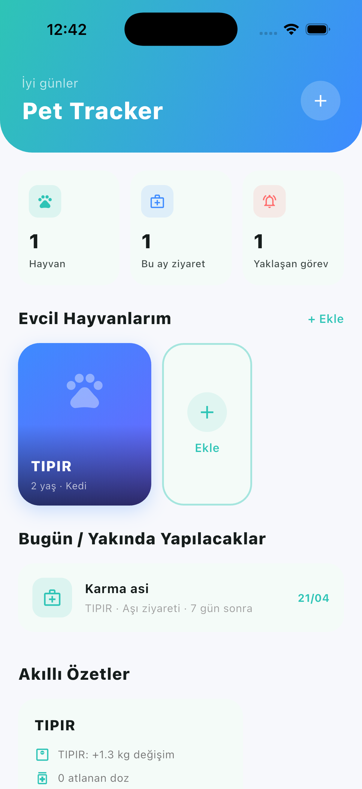
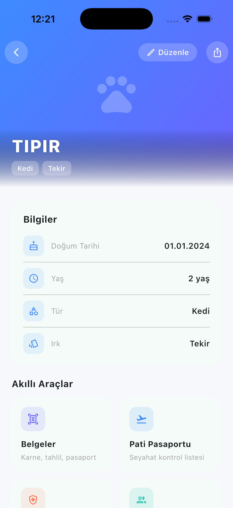
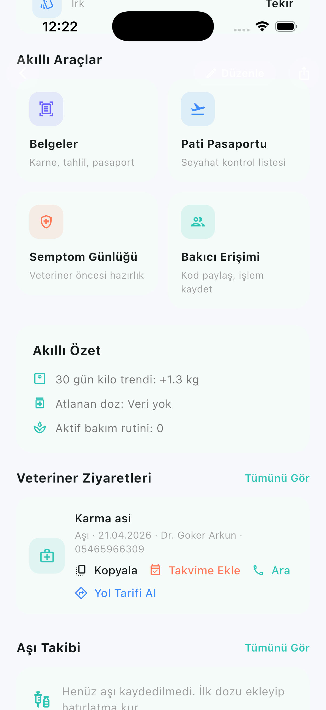
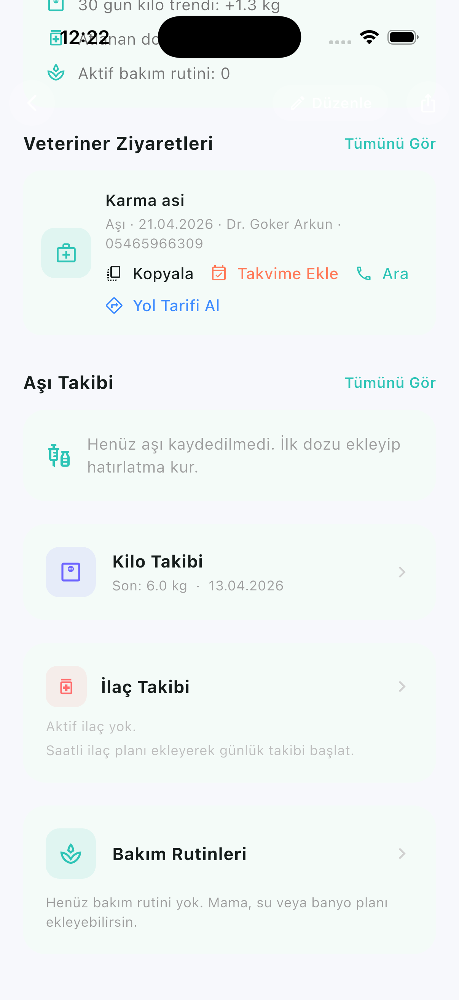
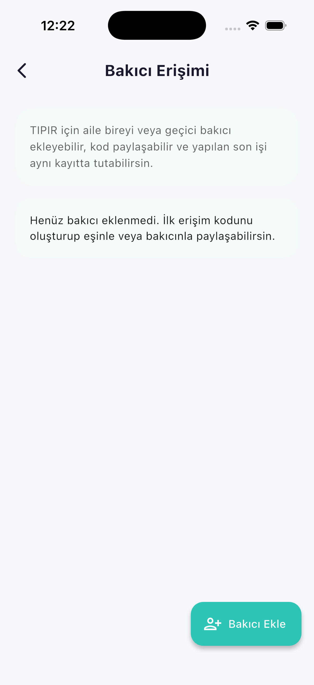
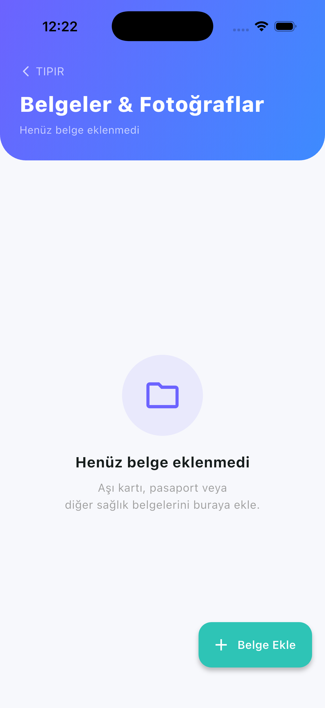
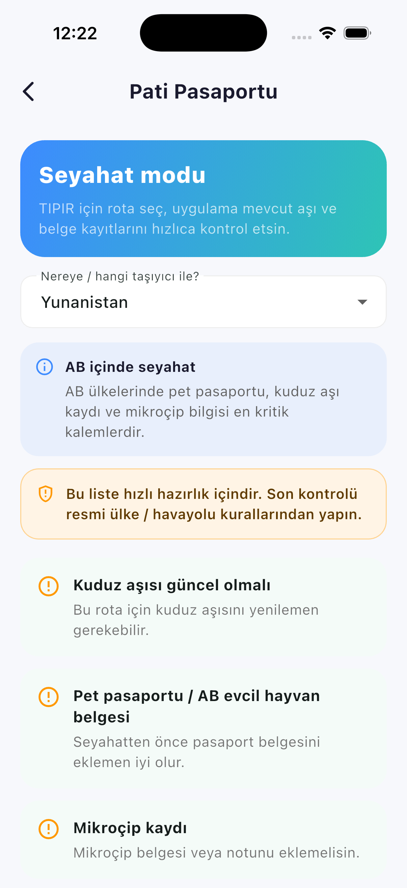
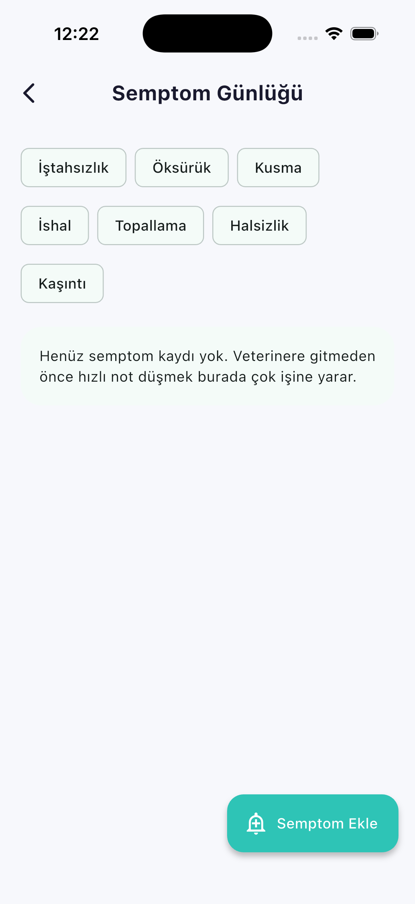
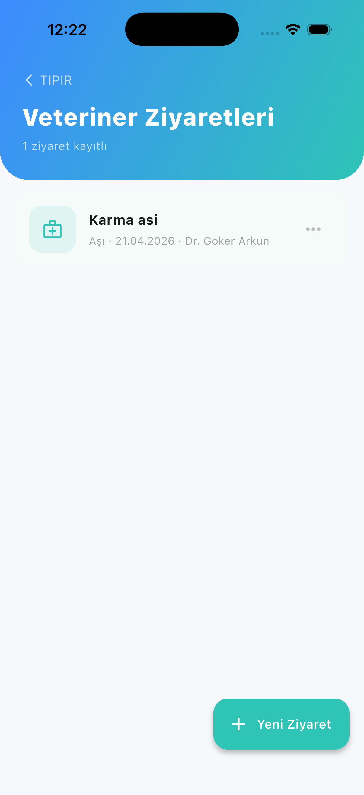
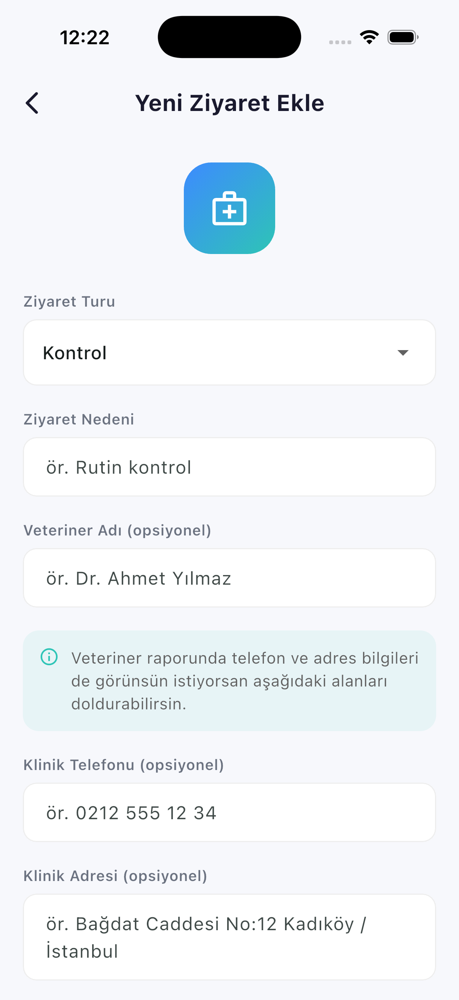

# Pet Tracker

Evcil dostunun sağlık ve bakım planı tek uygulamada.

Pet Tracker, evcil hayvan sahiplerinin aşı, ilaç, bakım, kilo ve veteriner süreçlerini tek yerden takip edebilmesi için geliştirilen bir Flutter uygulamasıdır.

## Öne Çıkan Özellikler

- Evcil hayvan profili oluşturma
- Aşı takibi ve yaklaşan doz mantığı
- İlaç takibi, günlük log ve bildirim aksiyonları
- Bakım rutinleri ve hatırlatmalar
- Veteriner ziyaretleri, adres ve telefon bilgileri
- PDF sağlık özeti ve paylaşım akışları
- Pati Pasaportu ile seyahat hazırlık checklist’i
- Semptom günlüğü ve veteriner hazırlık notları
- Bakıcı erişimi için yerel MVP akışı

## Kullanılan Teknolojiler

- Flutter
- Dart
- sqflite
- flutter_local_notifications
- share_plus
- pdf
- url_launcher

## Projeyi Çalıştırma

```bash
cd /Users/goker/Pet_Tracker/pet_tracker
flutter pub get
flutter run
```

iOS simulator için:

```bash
flutter run -d "iPhone 17"
```

## Release Dokümanları

- Launch öncesi checklist: [RELEASE_CHECKLIST_TR.md](./RELEASE_CHECKLIST_TR.md)
- Launch durum özeti: [RELEASE_STATUS_TR.md](./RELEASE_STATUS_TR.md)

## Ekran Görüntüleri

> Not: Görselleri `assets/screenshots/` klasörüne aşağıdaki dosya adlarıyla eklediğinde bu bölüm otomatik düzgün görünür.

### Dashboard



### Profil



### Akıllı Araçlar ve Modüller




### Bakıcı Erişimi



### Belgeler



### Pati Pasaportu



### Semptom Günlüğü



### Veteriner




## Durum

- Bu repo aktif geliştirme aşamasındadır.
- Launch öncesi son doğrulamalar için release dokümanları kullanılmalıdır.

## Notlar

- Kamera ile otomatik OCR’dan aşı tarihi okuma özelliği launch sonrası daha sağlam bir sürümle geri eklenecek.
- Pati Pasaportu şu an hızlı hazırlık rehberi olarak çalışır; resmi ülke / havayolu kural doğrulamasının yerini almaz.
